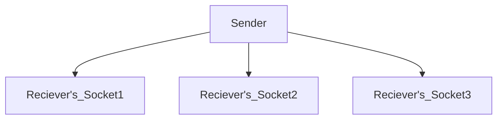
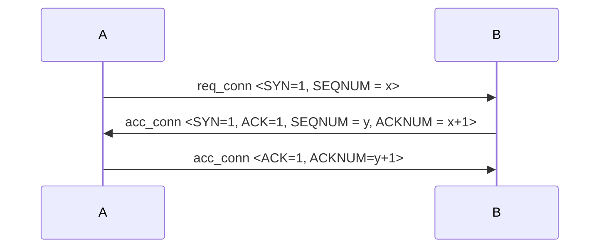
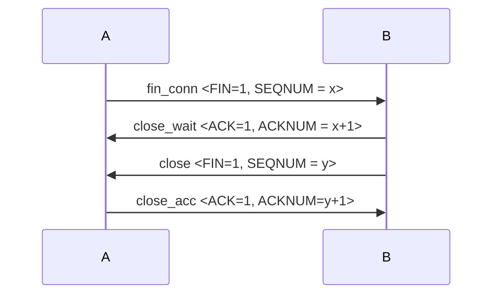

# Transport Layer

## Transport Layer의 특징

- 목적 :  종단(Terminal)간 신뢰성 있는 통신을 목표로 한다.
- 데이터의 단위는 Segment(세그먼트)이다.
- 고유한 port번호를 가진다. Multiplexing과 Demultiplexing에 이용된다.
- 흔히 우리가 사용하는 Socket이 Transport Layer단계에서의 통신을 위한 인터페이스이다.


## 다중화(Multiplexing) 와 역다중화(Demultiplexing)

하나의 터미널이 여러명의 터미널과 동시에 통신하는 경우를 생각해보자, 

다음 과 같은 상황에서 Sender는 Reciever에게 소켓에 따라 데이터를 구분지어 전송해야 한다. 

하나의 회선에서 Sender가 Reciever의 서로 다른 Socket에 데이터를 보내기 위해서, Multiplexing이라는 기술을 이용한다.

### Multiplexing 
서로 관심사가 다른(독립적인) 데이터를 회선을 분리하지 않고, 하나의 회선을 통해 보내기 위해 <b>묶는 작업</b>. 이때 Port 번호를 통해 Labeling을 한다.

### Demultiplexing 
Multiplexing의 반대작업으로, 하나의 회선을 통해 받은 데이터 묶음을 Port번호를 통해 <b>분리하는 작업</b>.


## UDP 프로토콜

### UDP의 특징
- 비연결지향형
- 간단한 구조
- 데이터 전송 순서를 보장하지 않는다.
- TCP에 비해 상대적으로 빠르다.
- TCP에서 제공되는 다양한 기능(흐름제어, 혼잡관리, 신뢰성)

### UDP의 헤더구조
[ Src_Port ]  : 시작지점의 포트
[ Dst_Port ] : 도착지점의 포트
[ Semgent_Length ] : 세그먼트의 길이
[ Checksum ] : 체크섬

### UDP의 데이터 전송 과정

1. src에서 dst로 데이터를 송신한다.
2. 수신자 측이 데이터의 checksum을 검사한다.
3. checksum이 데이터로 부터 계산한 값과 일치하지 않으면
해당 패킷을 <b>버리고</b>, 그렇지 않으면 <b>수신</b>한다.


## TCP 프로토콜

### TCP의 특징

#### 점대 점 통신
TCP는 오직 1:1 통신만을 지원한다. 

#### 연결지향형 통신
TCP는 통신 과정에서 3-way handshaking 방법으로, sender와 receiver가 서로가 송/수신을 할 준비가 되었는지 검사하며,  init으로 데이터 연결을 establish 하고, close를 통해 데이터 연결을 close한다. 

Timeout을 도입하여, 일정기간 SYN에 대해 성공적으로 ACK를 수신하지 못했을 경우 Close로 간주한다.

#### 신뢰성있는 통신
데이터의 전송을 보장하기 위해 Sender는 Receiver와 연결되어 있는 한 데이터를 온전히 보내기 위해 최선을 다한다.

데이터 송신과정에서 일부 혹은 전부가 소실되더라도, 신뢰성이 보장되어야 하므로, 이 경우 소실된 부분을 성공할때까지 어떻게든 재전송을 시도한다.

#### 파이프라이닝
성능을 위해 연속된 데이터를 한번에 보낸다. 

#### 3-way handshaking
TCP는 두 종단간 연결을 보장하기 위해 3-way handshaking을 이용한다. 

3-way handshaking은 연결과정에서 사용한다.

3-way 절차
>(1) : A -[SYN]-> B             
 - A가  B에게 필요한 데이터를 보낸다.(SYN)
>(2): B->[SYN+ACK]-> A   
- B가 A의 SYN을 성공적으로 받았음을 알리는 응답(ACK)과 함께 A에게 필요한 데이터를 보낸다.(SYN) 
>(3): A->[ACK] ->B           
- A가 다시 B의 SYN+ACK를 성공적으로 받았음을 알리는 응답(ACK)을 보낸다.

#### 데이터의 순서 제공
TCP는 데이터를 여러 번 쪼개보낼때, sequence number를 통해 데이터의 순서를 기록한다. 

수신자 측에서 해당 sequence number에 따라 데이터를 정렬하여 원래의 데이터의 순서를 복원 할 수 있다.

#### 전이중(full duplex) 통신
TCP는 UDP와 달리 통신하는 두 종단간 양방향 통신이 지원된다.
즉, 하나의 연결동안 A가 B에게 데이터를 보내면, 그에 대해 B가 A에게 응답할 수 있다.

#### 흐름제어(Flow control)
Sender가 Receiver의 버퍼크기를 고려하여 한번에 보낼 데이터를 보내는 양을 조절한다. 데이터를 지나치게 한꺼번에 보내면 버퍼링(buffering)과 같은 오버헤드로 인해 성능이 저하 될 수 있기 때문이다.

Sender가 Receiver에게 자신이 앞으로 보낼 데이터의 남은 양, 그리고 자신의 free buffer space(rwnd)에 대한 정보를 보냄으로써, 차후 Receiver가 다시 Sender가 되어 자신에게 데이터를 보낼 때의 적절한 데이터의 양을 제공 할 수 있다.

데이터를 보낼때 Sliding Window 기법을 이용한다. 보낼 데이터를 seq번호에 따라 1,2,.....n 등으로 나열되어 있을때, 그 중 한번에 보낼 데이터를 window 크기로 조절하고, 매번 데이터를 보낸만큼 window를 이동시키거나, sender로 부터 전달받은 free buffer space에 따라 window의 크기를 변화 시킨다.

#### 혼잡관리 (Congestion Manager)
Sender가 Receiver에 대역폭 이상의 데이터를 보내면, 라우터의 Queue가 꽉차서 데이터가 소실될 수 있다.  혼잡관리는, Sender에서 Receiver로의 데이터를 보내는 과정에서 최적의 데이터 전송 속도를 고려한다.


(1) Slow Start
- 데이터 전송량을 초기값에서 부터 2배, 4배, 8배와 같이 2배 늘어나게 보내다가. 데이터가 처음으로 유실되면, 다시 데이터 전송량을 초기값으로 고정한다.

(2) AIMD 
- 데이터 전송시 데이터 유실율이 일정수치를 초과하게 되면, AIMD 방식으로 변경한다. 
- 데이터 전송량을 매번 기존 전송량보다 1 단위전송단위만큼 더 보내고, 데이터가 소실될 때 마다 데이터 전송량을 절반으로 줄인다.


### TCP의 헤더구조
[ Src_Port ]  : 시작지점의 포트
[ Dst_Port ] : 도착지점의 포트
[ Semgent_Length ] : 세그먼트의 길이
[ Checksum ] : 체크섬
[ Seq Number ] : seq의 번호
[ ACK Number ] : 수신하기를 기대하는 다음 seq번호
[ Offset ] :  해더 길이
[ Reserved ] : 예약된 필드. 현재는 사용하지 않음
[ TCP Flag ] : 
```
	U : 긴급 비트
	A : ACK 비트
	P : PUSH 비트
	S : SYN 비트
	F : FIN 비트
```
[ Windows ] : rwnd의 값이며, 자신의 여유 버퍼용량(Free buffer space)를 뜻함.
[ Urgent Pointer ] : 어디서부터 긴급 값인지에 대한 주소값


### TCP의 연결 및 연결 종료과정

(1) Establish





(2) Close




## Socket

### Socket의 개념
Socket은 Transport Layer단계의 프로토콜을 통해 종단간 양방향 데이터 송수신을 할 수 있도록 만든 <b>인터페이스</b>이다. 이때 Socket은 양방향 통신을 위한 Endpoint가 된다.


### Socket의 구분
```
- 서버 소켓 vs 클라이언트 소켓

Server Socket은 클라이언트로 부터 연결 요청이 오기를 기다렸다가(listen) 
연결 이후(accept) 클라이언트와 연결된 이후 데이터를 주고 받는다(read/write)

Client Socket은 서버프로그램으로 연결 요청(connect)을 하고, 연결 이후 데이터를 주고 받는다.
```

```
- Datagram Socket vs Stream Socket

Datagram Socket은 UDP 프로토콜을, Stream Socket은 TCP프로토콜을 이용한다.
```

### Socket의 주요 메소드 (Stream Socket을 기준으로)

클라이언트 :
1. socket :
소켓을 생성한다.
2. connect : 
서버에 연결을 시도한다.
3. read/write
데이터를 송신 혹은 수신한다.
4. close
서버와의 통신을 종료한다.

서버 :
1. socket :
소켓을 생성한다.
2. bind : 
ip주소/port에 해당 소켓을 할당한다.
3. listen :
클라이언트의 연결요청을 기다린다.
4. accept :
클라이언트의 요청을 승낙하고 연결을 만든다.
5. read/write
데이터를 송신 혹은 수신한다.
6. close
서버와의 통신을 종료한다.


### 문제
1. UDP에서 제공하지 않는 TCP의 기능 3가지를 설명하시오
2. Socket통신에서 Socket에 제공되는 API 중 bind와 listen의 의미를 설명하시오.