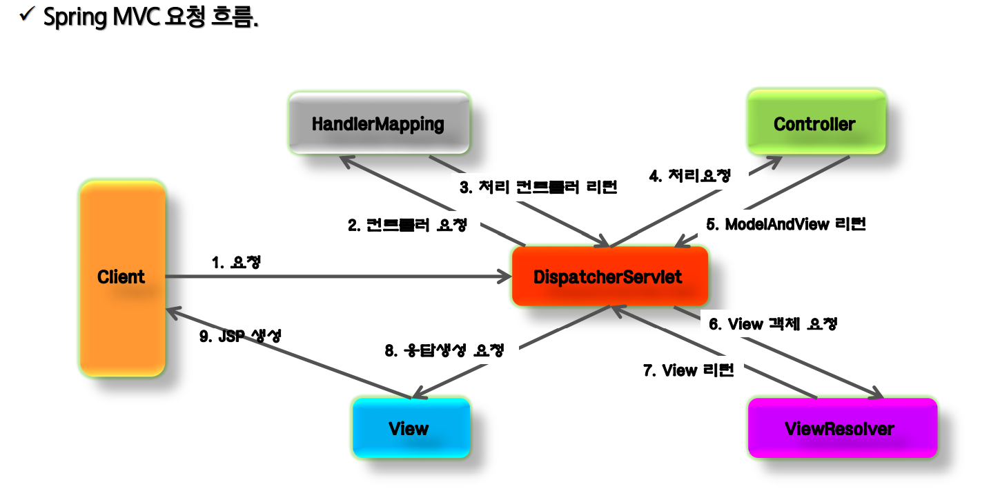
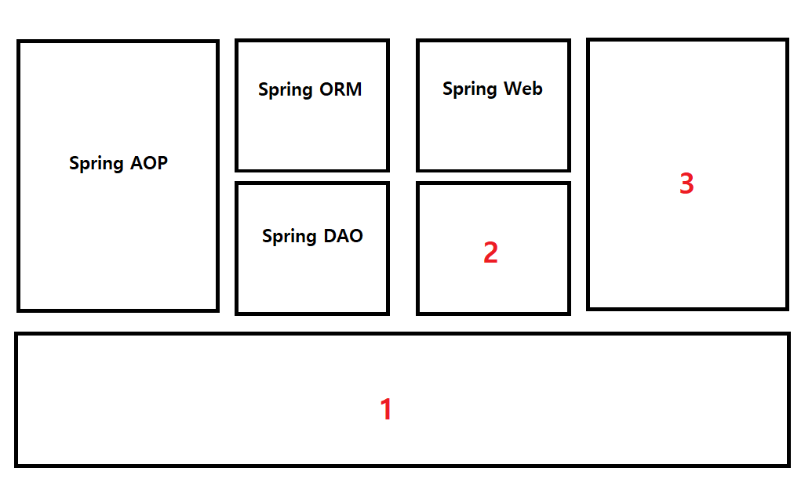

# Spring 답지

### 다음 중 POJO에 해당하는 설명은? (15~19P)

1. 특정 환경이나 기술에 종속적이지 않은 객체지향 원리에 충실한 자바 객체이다.
    1. 맞는 설명이다
2. 환경과 세부 기술의 변경과 관계없이 일관된 방식으로 기술에 접근할 수 있게 해 준다.
    1. PSA : Annotation이나 XML 사용하는 것
3. 유연하게 확장 가능한 객체를 만들어 두고, 의존 관계는 외부에서 다이나믹하게 설정한다.
    1. IoC / DI
4. 관심사의 분리를 통해 소프트웨어의 모듈성을 향상시킨다.
    1. AOP

### 다음 중 IoC에 해당하는 설명이 아닌 것은?(31 ~ 34P)

1. 객체 지향에서 Object간의 연결 관계를 런타임에 결정한다.
2. 객체 간의 관계가 강하게 연결된다.
    1. 약하게 연결된다.
3. DI는 IoC의 구현 방법 중 하나이다.
4. DI를 하는 방법은 Setter Injection과 Contrsuctor Injection 두 가지 방법이 있다.

### 다음 중 Application Context에 해당하지 않는 내용은 (48P)

1. Bean을 등록하고 관리하는 기능을 한다
2. 스프링이 제공하는 각종 부가 서비스를 추가로 제공한다
3. IoC컨테이너이다
4. Bean의 생성과 제어만을 담당한다.
    1. 스프링이 제공하는 애플리케이션 지원 기능도 모두 포함해서 이야기 하는 것이기 때문에 틀린 내용이다.

### 다음 중 빈의 생성 범위 지정으로 틀린 것은 (55p)

1. singleton
    
    스프링 컨테이너 당 하나의 인스턴스 생성
    
2. prototype
    
    HTTP Response별로 새로 생성 X
    
    **컨테이너에 빈 요청시 새로 생성**
    
3. request
    
    HTTP Request별로 새로 생성
    
4. session
    
    HTTP Session별로 새로 생성
    

## 10.19 교재



### 채우시오 (P.12)

요청

컨트롤러 요청

처리 컨트롤러 리턴

처리 요청

ModelAndView 리턴

View 객체 요청

View 리턴

응답생성 요청

JSP 생성

### 다음 중 web.xml에 기술된 내용이 아닌 것은

1. DispatcherServlet 설정
2. Filter 관련 내용
3. Welcome-File 등록
4. Interceptor 관련 내용
    1. servlet-context.xml에 있음
    

### 다음 REST관련 Annotation 중 틀린 것은? (CIA요약집)

1. @GetMapping
2. @PostMapping
3. @UpdateMapping
    1. @PutMapping이 맞음
4. @DeleteMapping
    
    

### 다음같이 Controller를 설정하고 실행 시 발생하는 에러는? (P.30)

AController.java

```java
...
@RequestMapping(method = RequestMethod.POST)
public String func(Model model) {
	model.addAttribute("Hello", "Hello");
	return "index";
}
...
```

404 에러 발생. requestmapping 안에 value로 주소를 설정해야 함.

```java
...
@RequestMapping(value="/func" method = RequestMethod.POST) // 틀린 지점
public String func(Model model) {
	model.addAttribute("Hello", "Hello");
	return "index";
}
...
```

### 다음 중 SpringBoot의 특징이 아닌 것은 (CIA 요약집)

1. 작업 결과를 jar로 패키징하여 단독 실행이 가능하다.
2. 미리 잘 짜인 라이브러리의 조합을 가지고 있어, 라이브러리 관리가 용이하다.
3. SpringBoot에서는 JSP를 기본 View로 권장하지 않으므로, 사용 시 추가 depencency를 설치해야 한다.
4. SpringBoot는 Spring과 같이 XML문서로 각종 프로퍼티를 설정한다.
    1. 아니다. application.properties파일을 통해 관리된다
    2. 이거는 우리 교수님이 공유해주신 시험문제 힌트에도 나옴. 주의!

**유연하게 확장 가능한 객체를 만들어 두고 객체간의 의존관계는 내부에서 설정 OX 퀴즈**

답 : X

1. **rest는?  스펠링**

Representational state transfer

1. **rest는? 정의**

**( ) 를 통해 제어할 자원을 명시하고 ( )를 통해 해당 자원을 제어하는 명령을 내리는 방식의 아키텍쳐**

1)http uri
2)http method

**4. 기존-> rest**

**crud)  Post get post get -> (? ? ? ?)**

답 : post get put delete

1. **연결해주세요**

**1)@responsebody**

**2)@requestbody**

**3)@restcontroller**

**4)@pathvariable**

**5)@crossorigin**

**a) JSON 데이터를 원하는 타입으로 바인딩**

**b) JSP 같은 뷰로 전달되는 것이아니라 데이터 자체를 전달**

**c) URL경로에 있는 값을 파라미터로 추출**

**d) AJAX의 크로스도메인 문제를 해결**

**e) controller가 rest방식을 처리하기 위함을 명시**

답: 1 - b / 2 - a / 3 - e / 4 - c / 5 - d

# 답-chk

1. Spring프레임워크란?
- 정답: 자바 엔터프라이즈 개발을 편하게 해주는 **오픈소스 경량 애플리케이션 프레임워크**이다.

1. SPRING의 삼각형 핵심 4가지
- 정답:
- POJO,PSA,IoC/DI,AOP

1. 다음은 스프링프레임워크 모듈 그림이다. 1, 2, 3번에 들어갈 이름을 쓰고, 1번 컨테이너의 주요 컴포넌트도 쓰시오.
    
    
    
- 1:Spring Core / 2:Spring Context / 3:Spring MVC / 1의 주요 컴포넌트: BeanFactory

1. IoC의 유형에 대한 설명이다. a~f까지 들어갈 이름을 적으세요

IoC는 a와 b 크게 두가지 유형으로 나눌 수 있다. 이때 a의 방식으로는 c가 있다. b의 방식으로는 d,e,f 3가지가 있다.

- 정답:
- a)DL(Dependency Lookup)
- b)DI(Dependency Injection)
- c)JNDI Lookup
- d)Setter Injection
- e)Constructor Injection
- f)Field Injection

1. IoC의 장점
- 정답: 객체간의 결합도를 낮춘다.

1. SpringBoot의 설명으로 틀린 것은?
    1.  xml 문서 대신 각종 프로퍼티를 설정하는 파일이 있다. 이 파일의 이름은 application.properties이다.
    2. 스프링부트는 Spring FrameWork의 성능 향상을 위한 것이다.
- 정답:  b:스프링부트는 Spring FrameWork의 성능 향상을 위한 것이 아니다

1. 빈칸에 들어갈 단어(1)~(3)들을 순서대로 쓰세요

Spirng DI Container가 관리하는 객체를 __(1)__이라고 하며, 이 빈들의 Life Cycle을 관리하는 의미로 ____(2)____라고 한다.

____(2)____에 여러가지 기능을 추가하여 ____(3)____라고 한다.

일반적으로 ____(2)____를 바로 쓰지 않고 ____(2)____를 상속받은  ____(3)____를 일반적으로 이용한다

- 정답:  Bean, BeanFactory, ApplicationContext

1. 다음 스프링컨테이너의 상속관계를 보고 빈칸에 들어갈 단어를 쓰세요

BeanFactory ← ApplicationContext ←____________

- 정답:  WebApplicationContext

1. 스프링빈은 기본적으로 싱글톤 타입으로 만들어진다.싱글톤이 아닌, 항상 새로운 인스턴스를 반환하게 하고 싶으면 scope=”_______”으로 설정한다
- 정답:  prototype

1. 스프링 빈 설정은 xml형태로 기술해도 되지만, 관리의 번거로움을 해결하기 위해 어노테이션 @_______를 사용한다. 이때 어노테이션으로 빈을 설정할 경우 반드시 xml에 <context:component-scan base-package:””>을 써줘야 한다. 
- 정답:  Autowired

1.  web.xml에 꼭 넣어야 하는 3가지
- 정답:
- ContextLoaderListener
- DispatcherServlet
- characterEncodingFilter

1. 스테레오타입 어노테이션 4가지이다. 다음 중 하나가 나머지 3개를 포괄한다. 어떤 것일까?

@Repository

@Service

@Controller

@Component

- 정답:  어노테이션 @Component는 나머지 3개를 포괄한다
- @Component = @Controller + @Service + @Repository

1. 스프링빈 의존 관계 설정중 틀린 것을 골라 바르게 고치시오
    1. 생성자 주입은 <constructor-arg><value></value></constructor-arg>를 쓰는 ‘하위태그’ 이용과 <constructor-arg value=””>을 쓰는 ‘속성’ 이용 방식 두가지가 있다.
    2. argument의 순서를 지키지 않을 경우, 하위태그를 이용해야 하며 속성 type,index,name을 이용하여 매칭시킨다
    3. 하위 태그를 이용할 때 argument로 객체 주입 시 <constructor-arg><ref=””/></constructor-arg>로  쓴다.
    4. 속성 방식을 이용할 때 argument로 객체 주입 시 <constructor-arg ref=”></constructor-arg>로  쓴다.
    - 정답 C
    - 하위 태그를 이용할 때 argument로 객체 주입 시 <constructor-arg><ref bean=””/></constructor-arg>로  쓴다.
    
    1. root-context.xml / servlet context.xml 중에 다음 설명에 해당하는 파일은?
    
    View에 관한 것을 명시한다.
    
    - 정답: servlet context.xml
    
    1. 파일업로드시 메소드는 POST로 해야 한다?
    - 정답: O


<Q1> 개발자가 생성한 Class를 Spring의 Bean으로 등록할 때 사용하는 어노테이션은?

1. @Bean
2. @Class
3. @Component
4. @Autowired

A) 3번

@Autowired: Spring Framework에서 Bean 객체를 주입받기 위한 방법은 크게 아래의 3가지가 있습니다. Bean을 주입받기 위하여 @Autowired 를 사용합니다. Spring Framework가 Class를 보고 Type에 맞게(Type을 먼저 확인 후, 없으면 Name 확인) Bean을 주입합니다.

---

<Q2> 요청들어온 URI의 요청과 어노테이션 밸류값이 일치하면 해당 클래스/메소드가 실행되도록하는 어노테이션은?

1. @RequestMapping(value="")
2. @GetMapping(value="")
3. @RequestParam(value="")
4. @Mapping(value="")

A) 1번

---

<Q3> 각 방식에 맞는 매핑은?

1. INSERT -> ( )
2. SELECT -> ( )
3. UPDATE -> ( )
4. DELETE -> ( )

A) 순서대로 @PostMapping / @GetMapping / @PutMapping / @DeleteMapping

---

<Q4> 다음 두 방식의 차이점을 말하시오
GET [http://youngjinmo.github.io/member?id=2](http://youngjinmo.github.io/member?id=2)
GET [http://youngjinmo.github.io/member/2](http://youngjinmo.github.io/member/2)

A) 위 : 쿼리스트링으로 파라미터를 URL로 전송할 때엔 컨트롤러에서 파라미터를 받을때 `@RequestParam`을 사용한다.

아래 : RESTful하게 파라미터를 받기 위해서 컨트롤러에서 `@PathVariable`어노테이션을 사용했다.

---

<Q5> (     )이란, Controller의 핸들러를 호출하기 전, 후에 요청과 응답을 참조하거나 가공할 수 있는 일종의 필터이다.
요청에 의해 서버에 들어온 Request객체를 핸들러에 도달하기 전에 개발자가 추가적인 작업을 한 후 핸들러로 보낼 수 있다.

A) Interceptor

---

<Q6> (     )은 자바 라이브러리로 반복되는 getter, setter, toString등의 반복 메서드작성을 줄여주는 라이브러리이다.
어노테이션을 제공하고 이를 기반으로 반복 소스코드를 컴파일 과정에서 생성해준다.

A) lombok

---

<Q7> 파일 업로드할때 3가지 필수로해야할것은?

A) enctype(multipart/form-data) / input type=file / method=POST

---

<Q8> 다음 중 SOLID에 관한 내용이 틀린것은?

1. SRP : 객체는 단 하나의 책임만 가질 수 있다 -> 객체 간 응집도는 높고 결합도가 낮아진다
2. OCP : 기존코드 변경하지않고 확장할 수 있어야 한다 -> Spring Container가 이 역할을 담당한다
3. LSP : 부모클래스를 상속하는 자식클래스는 부모클래스의 기능을 자유롭게 오버라이딩할 수 있어야한다
4. ISP : 여러 구체적인 인터페이스로 나눠주는 것이 객체지향관점에서 더 좋은 설계이다
5. DIP : DI, DI Container로 자바 객체의 의존성을 역전해준다

A) 3번 부모클래스를 상속하는 자식클래스는 부모클래스의 기능을 무시하거나 오버라이딩을 자제해야한다. 효도하라!

---

<Q9> WebXml에 필요한것 3가지는?

A) ContextLoaderListener/DispatcherServlet/CharacterEncodingFilter

---

<Q10> 다음 중 Body에 전달되는 데이터를 메소드의 인자와 매칭시켜 데이터를 받아 처리할수있는 어노테이션으로 JSON -> Dto 로 변환하는 것은?

1. @Autowired
2. @RequestParam
3. @RequestBody
4. @ResponseBody

A) 3번


# Java Spring 대비 퀴즈 (🔥)

## 1. Spring Framework에서 지원하는 기능에 대한 설명으로 옳지 않은 것은?

(1) Spring DAO를 통한 스프링 프레임워크와 JDBC 및 ORM 프레임워크와의 연동 지원

(2) Spring AOP를 통해 AspectJ에서 지원하는 AOP확장 기능제공

(3) Filter를 통해 Servlet에 전달되는 메세지에 대한 전/후처리 제공

(4) Interceptor를 통해 HandlerMapping 전/후 요청과 응답을 참조하거나 가공할 수 있는 기능 제공.

## 2. Spring Container, Bean에 대한 설명으로 옳지 않은 것은?

(1) Spring Bean은 스프링이 IoC 방식으로 관리하는 객체를 말한다.

(2) BeanFactory는 Spring Container에 해당하며, Bean을 조회 생성 또는 반환하는 역할을 한다.

(3) ApplicationContext는 BeanFactory을 확장하여 만든 것으로 BeanFactory에서 제공하는 기능 이외에 추가적인 기능을 제공한다. Spring Context 모듈에서 제공된다. 일반적으로 BeanFactory대신 사용된다.

(4) Spring Container의 주 목적은 Bea**n**을 프로그래머가 아닌 IoC 컨테이너를 통해 관리하도록 위임하므로써 결합도를 증가시켜 유지보수 비용을 감소시킨다.

## 3. (Spring AOP)다음 코드를 보고 옳은 것을 고르세요

```java
@Before(value = "execution(* com.ssafy.board.model..Board*.*(..))")
public void loggin(JoinPoint joinPoint) {
	logger.debug("before call method : {} ", joinPoint.getSignature());
	logger.debug("메서드 선언부 : {} 전달 파라미터 : {}", joinPoint.getSignature(), Arrays.toString(joinPoint.getArgs()));
}
```

(1) 메소드 public void loggin(JoinPoint joinPoint)는 Aspect에 해당한다.

(2) com.ssafy.board.model.service 패키지 위에 있는 BoardServiceImpl 클레스내 writeArticle() 함수 Target에 해당하며 해당 메소드가 실행되기 이전영역은 advice의 JoinPoint에 해당한다.

(3) @Before를 통해 JoinPoint의 위치를 결정한다.

(4) @Before는 Pointcut에 해당한다.

## 4. (MyBatis) 다음 코드를 보고 올바른 해석을 고르시오

```xml
<insert id="writeArticle" parameterType="boardDto">
	insert into board (user_id, subject, content, hit, register_time)
	values (#{userId}, #{subject}, #{content}, 0, now())
	<selectKey resultType="int" keyProperty="articleNo" order="AFTER">
		select last_insert_id()
	</selectKey>
</insert>
```

```java
public _____ writeArticle(BoardDto boardDto);
```

(1) ____칸에 들어갈 리턴타입은 int 타입이며, insert가 수행된 이후 boardDto의 articleNo를 리턴한다.

(2) ____ 칸에 들어갈 리턴타입은 void타입이며, insert가 수행된 이후 boardDto의 articleNo컬럼이  auto_increment인 경우 1을 증가시킨다.

(3) ____칸에 들어갈 리턴타입은 int 타입이며, insert가 수행하고 난 이후, Transaction동안 insert가 된 row의 개수를 리턴한다.

(4) ____칸에 들어갈 리턴타입은 String 타입이며, insert가 수행하고 난 이후, userId값을 내놓는다.

## 5. 다음 중 생략 가능한  어노테이션은?

```java
(1)*@RestController
@RequestMapping("/user")
public class MemberController {

@GetMapping("/{userid}")
(2)@ResponseBody

public String idCheck((3)@PathVariable("userid") String userId) throws Exception {
logger.debug("idCheck userid : {}", userId);
int cnt = memberService.idCheck(userId);
return cnt + "";
}

@PostMapping("/login")
public String login((4)@RequestParam Map<String, String> map, Model model, HttpSession session, HttpServletResponse response) {
logger.debug("map : {}", map.get("userid"));
try {
MemberDto memberDto = memberService.loginMember(map);
logger.debug("memberDto : {}", memberDto);
if(memberDto != null) {
session.setAttribute("userinfo", memberDto);			
Cookie cookie = new Cookie("ssafy_id", map.get("userid"));
			cookie.setPath("/board");
			if("ok".equals(map.get("saveid"))) {
				cookie.setMaxAge(60*60*24*365*40);
			} else {
				cookie.setMaxAge(0);
			}
			response.addCookie(cookie);
			return "redirect:/";
		} else {
			model.addAttribute("msg", "아이디 또는 비밀번호 확인 후 다시 로그인하세요!");
			return "user/login";
		}
	} catch (Exception e) {
		e.printStackTrace();
		model.addAttribute("msg", "로그인 중 문제 발생!!!");
		return "error/error";
	}
}
}*
```

(1) *@RestController*

(2) *@ResponseBody*

(3) *@PathVariable*

(4) *@RequestParam*

답 : 

1.(3) : Filter는 Spring이 아닌 J2EE(jsp/servlet)에서 제공되는 기능. Spring과 무관하다.

2.(4) : 결합도를 감소시킨다.

3.(2)

4.(1)

5.(2)
