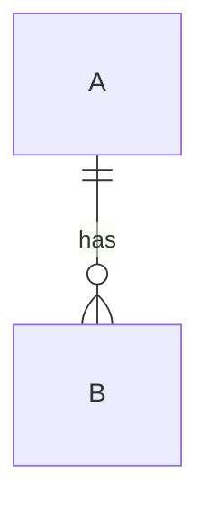

## 객관식 문제 1


RDBMS 에서 뷰(View)에 관한 설명으로 옳지 않은 것은?

```
1. 뷰는 사용자에게 접근이 허용된 자료만을 제한적으로 보여주기 위해 하나 이상의 기본 테이블로 부터 유도된, 이름을 가진 가상 테이블이다.

2. Alter View를 통해 구조를 변경 할 수 있다.

3. 제한적이지만 View를 통해 실제 테이블에 데이터를 삽입 할 수 있다.

4. 뷰를 통해 다른 뷰를 생성할 수 있다.
```
<details>
<summary>정답보기</summary>
정답  : 2 <br/>뷰는 삭제 또는 생성만 가능하며, 그 구조를 바꿀 수 없다.<br/>
부연설명 : 3. 뷰내 기본키가 있고, 뷰내 없는 Column의 default가 정의되어 있다면 삽입이 가능하다. 
</details>

---

## 객관식 문제 2

[MySQL] 다음 SELECT문을 보고 물음에 답하시오.


### [보기]
다음과 같이 EXAM 테이블이 존재한다. 

| id    | score |
|-------|-------|
| ssafy | 70    |
| ssapy | 85    |
| ssary | 20    |


### [문제]
exam테이블내 id, score, result를 가져오는데,  
#### result는 score가 
- 0~50 일시 "C", 
- 51~70 일시 "B",
- 71 이상일시 "A"

로 표시하려고 한다.

```sql
SELECT  id, score, ______ FROM exam
```
빈칸에 들어갈 말로 적절한 것은?
```
1. CASE 
	WHEN score <= 50 THEN "C" 
	WHEN score <= 70 THEN "B" 
	ELSE "A" 
  END `result`
  
2. CASE 
	IF score <= 50 THEN "C" 
	IF score <= 70 THEN "B" 
	ELSE "A" 
  END `result`
  
3. (CASE score <= 50 THEN "C" 
	CASE score <= 70 THEN "B" 
	ELSE "A") `result`
	
4. CASE WHEN score <= 50 THEN "C" 
   CASE WHEN score <= 70 THEN "B" 
   ELSE "A" 
   END CASE `result`
```
<details>
<summary>정답보기</summary>
	정답  : 1<br/>CASE WHEN (cond) THEN '값' WHEN (cond) THEN '값' ELSE '값' END 
</details>


---
## 객관식 문제 3


다음 테이블이 다음과 같이 존재할 때 옳은 것은?


| 학번 | 주민번호       | 이름   | 성별 | 나이 |
|------|----------------|--------|------|------|
| 1001 | 991212-1234567 | 김싸피 | M    | 23   |
| 1002 | 991010-2345678 | 이싸피 | F    | 23   |
| 1003 | 000123-4680246 | 정싸피 | F    | 22   |
| 1004 | 980706-1234321 | 박싸피 | M    | 24   |
| 1005 | 960906-2147483 | 남싸피 | F    | 26   |
| 1006 | 001020-3040506 | 강싸피 | M    | 22   |

단. {학번}, {주민번호}는 각각 Unique하고 Not Null 하다. 

---

```
1. {학번,주민번호,이름} 은 후보키(Candidate Key)에 해당한다.

2. {성별, 나이} 는 슈퍼키(Super Key)에 해당한다.

3. {주민번호}를 통해 {성별}을 알 수 있으므로, {주민번호}는 {성별} 의 외래키 (Foreign Key)에 해당한다.
 
4. {학번}은 기본키(Primary Key)가 될 수 있으며, 만약 {학번}이 기본키가 되면, {주민번호} 는 대체키(Alternative Key)가 된다.
```
<details>
<summary>정답보기</summary>
	정답  : 4<br/>후보키는 유일성과 최소성을, 슈퍼키는 유일성을 만족해야 한다. 후보키 중 하나를 기본키로 설정하며, 기본키는 테이블에서 두개 이상 존재할 수 없다. 외래키는, 테이블내에서 다른 테이블내 컬럼을 참조하며, 테이블 간 관계를 나타낼때 사용한다. 
</details>

---
## 객관식 문제 4


다음 테이블이 다음과 같이 주어졌다.


| <U>학번</U> | <U>과목코드</U>       | 이름   | 점수 |
|------|----------------|--------|------|
| 1001 | A00001 | 김싸피 | 65    |
| 1002 | A00001 | 이싸피 | 80    |
| 1003 | A00002 | 정싸피 | 89    |
| 1004 | A00002 | 박싸피 | 100    |
| 1005 | A00002 | 남싸피 | 76    |
| 1006 | A00002 | 강싸피 | 48    |

테이블의 기본키는 {학번, 과목코드}가 된다고 하자

이때 테이블의 함수 종속 관계는 다음과 같다.

{학번, 과목코드} -> {점수}
{학번} -> {이름}

- 이때 해당 테이블의 정규화 수준으로 옳은 것은?

---

```
1. 1NF를 만족하지 않는다.

2. 오로지 1NF를 만족한다.

3. 2NF를 만족한다.
 
4. 3NF를 만족한다.
```
<details>
<summary>정답보기</summary>
	정답  : 2<br/>해당 테이블에서 {이름}은 오로지 {학번}에 의존하므로, 부분종속에 해당한다. 따라서 2NF를 만족하지 않는다. 테이블의 모든 Column의 값은 원자값을 가진다. 1NF를 만족한다.
</details>

---

## 객관식 문제 5


RDBMS 에서 인덱스(Index)에 관한 설명으로 옳지 않은 것은?

```
1. 테이블 생성시, 자동적으로 Primary Key의 인덱스가 만들어진다.

2. 특정 Column 집합의 Index를 만들게 될 시, 그 Column 집합을 이용한 정렬과 색인의 속도가 빨라진다.

3. Index를 사용한 테이블은 그렇지 않는 테이블보다 Insert 처리속도가 더 빠르다.

4. Index는 일반적으로 B+Tree로 구현한다. 
```
<details>
<summary>정답보기</summary>
	정답  : 3<br/>Index는 색인, 정렬의 속도 향상은 기대할 수 있어도, Insert, Delete시 속도향상은 기대할 수 없다. 오히려 인덱스내 데이터 삽입 삭제작업이 일어나므로 속도면에서 불리하다.
</details>

---

## 객관식 문제 6


다음 ER 다이어그램의 관계(Relation)에 대해 잘못 해석한 것은?



```
1. A는 적어도 1개의 B와 연결 되어야 한다.

2. B는 오로지 한개의 A와 연결 될 수 있다.

3. A는 여러개의 B와 연결 될 수 있다.

4. A와 B는 1:N 관계를 가진다.
```
<details>
<summary>정답보기</summary>
	정답  : 1<br/>A는 B의 관계는 0..n이므로 A는 B를 0개 이상 가질 수 있다. 즉, 반드시 B를 가질 필요는 없다.
</details>

---


## 객관식 문제 7


다음 Java DTO 클레스와 MyBatis Mapper 파일이 다음과 같이 존재할때, 빈칸에 들어갈 말로 적절한 것은?

```java
public class BoardDto {

	private int articleNo;
	private String userId;
	private String userName;
	private String subject;
	private String content;
	private int hit;
	private String registerTime;
	private List<FileInfoDto> fis;
}
```
[목적] BoardDto가 주어졌을때, List내용을 전부 포함하여 테이블에 Insert하려고 한다.
```xml
	<insert id="registerFile" parameterType="boardDto">
		insert into file_info (article_no, save_folder, original_file, save_file)
		values
		<foreach (A)_______="fis" (B)_______="fi" separator=" , " index="idx">
			(#{articleNo}, #{fi.saveFolder}, #{fi.originalFile}, #{fi.saveFile})
		</foreach>
	</insert>
```


```
1. (A) collection, (B) var

2. (A) collection, (B) item

3. (A) items, (B) var

4. (A) items, (B) item
```
<details>
<summary>정답보기</summary>
	정답  : 2<br/>mybatis foreach문의 property는 collection(전달할 array 또는 list), item(collection내 하나의 원소),index(1씩 증가하는 index번호), separator(구분 기호), open(시작 기호), close(끝 기호) 가 있다.
</details>

---
## 객관식 문제 8


[Mybatis] #{variable}과 ${variable}의 차이로 옳지 않은 것은? 

```
1. ${}의 형식은 파라미터를 바로 출력시키므로, SQL Injection에 취약하다.

2. #{}의 형식은 파라미터를 안전하게 문자열로 바인딩한뒤 출력시킨다.

3. #{} 방식은 단순히 파라미터를 Single Quoto('), Double Quoto("), Backtick(`) 감싸는 것이 아니므로, (',",`) 등을 Escape하여 쿼리를 삽입하는 SQL Injection 공격도 안전하게 방어할 수 있다. 

4. #{} 방식은 String만 출력하므로, 삽입 또는 조회하려고 하는 Column이 Varchar또는 char가 아닌 Date, int등과 같은 비문자열 형식일 경우 사용이 불가능하다.
```
<details>
<summary>정답보기</summary>
	정답  : 4<br/>int, date형 등 다른 타입 역시 모두 사용 가능하다.
</details>

---
## 주관식 문제 1


다음 보기는 SQL 문법 구문의 일부이다. 

보기를 보고 해당 보기가 DDL(Data Definition Language), DCL(Data Control Language), DML(Data Manipulation Language), TCL(Transaction Control Language)중 어디에 해당하는지 쓰시오.

### 보기
```
INSERT, ROLLBACK, CREATE, ALTER, 
REVOKE, GRANT, DROP, DELETE, 
COMMIT, SELECT, TRUNCATE, UPDATE
```


<details>
<summary>정답보기</summary>
	정답  : <br/>
	DDL :CREATE, ALTER, DROP, TRUNCATE<br/> 
	DCL: GRANT, REVOKE<br/>
	DML: INSERT,SELECT,DELETE,UPDATE<br/>
	TCL: COMMIT,ROLLBACK

</details>

---
## 주관식 문제 2


다음 SQL에서 모든 학생의 이름을 가져오려고 할때, 중복을 제거하기 위해 빈칸에 채워넣어야 하는 것은?

```sql
SELECT ______ name FROM student;
```


<details>
<summary>정답보기</summary>
	정답  : DISTINCT <br/>
</details>

---
## 주관식 문제 3


다음 SQL에서 학생의 이름중 Steven으로 시작하는 사람의 id를 가져오려고 한다. 

빈칸에 적절한 말을 쓰시오.

```sql
SELECT id, name FROM student WHERE id _____ _____;
```


<details>
<summary>정답보기</summary>
	정답  : LIKE "Steven%" <br/>
</details>

---

## 주관식 문제 4


다음 SQL 내장함수의 의미를 파악하고 SQL 출력 결과를 쓰시오.

```sql
SELECT MID('abcdefg', 2, 4) FROM DUAL;
```


<details>
<summary>정답보기</summary>
	정답  : "bcde" <br/>
</details>

---
## 주관식 문제 4


각 반별의 지금까지 치룬 모든 시험 성적의 평균을 구하려고 한다. 빈칸을 채워 넣으시오.

```sql
SELECT c.cid `반id`, ____(score) `평균점수` 
FROM EXAM e JOIN CLASS c 
WHERE e.cid = c.cid
GROUP BY cid;
```


<details>
<summary>정답보기</summary>
	정답  : avg<br/>
</details>

---

## 주관식 문제 5


cid를 이용하여 Student 테이블과 Class 테이블을 Inner Join한 결과를 출력하려고 한다. 빈칸을 적절히 채우시오.

```sql
SELECT *
FROM STUDENT s JOIN CLASS c 
_____(cid)
```


<details>
<summary>정답보기</summary>
	정답  : using<br/>
</details>

---

## 주관식 문제 6


다음 Java DTO 클레스와 MyBatis Mapper 파일이 다음과 같이 존재한다. 물음에 답하시오.

```java
public class BoardDto {

	private int articleNo;
	private String userId;
	private String userName;
	private String subject;
	private String content;
	private int hit;
	private String registerTime;
	private List<FileInfoDto> fis;
}
```
[목적] getTotalArticleCount내 서브쿼리로 search를 넣으려고 한다.
```xml
	<resultMap type="boardDto" id="article">
		<result column="article_no" property="articleNo"/>
		<result column="user_id" property="userId"/>
		<result column="user_name" property="userName"/>
		<result column="subject" property="subject"/>
		<result column="content" property="content"/>
		<result column="hit" property="hit"/>
		<result column="register_time" property="registerTime"/>
	</resultMap>
	
	<select id="getTotalArticleCount" parameterType="map" resultType="int">
		select count(article_no)
		from board
		<where>
			<______ refid="search"></______>
		</where>
	</select>
	
	<sql id="search">
		<if test="word != null and word != ''">
			<if test="key == 'subject'">
				and subject like concat('%', #{word}, '%')
			</if>
			<if test="key != 'subject'">
				and ${key} = #{word}
			</if>
		</if>
	</sql>
```
이때 빈칸 ______ 을 채워넣으시오.
<details>
<summary>정답보기</summary>
	정답  : include<br/>
</details>

---

1. 다음중 SQL문에 대해 틀린 설명은? (2개)

a. 모든 DBMS에서 사용이 가능하다

b. sql문은 데이터의 대소문자는 구분하지 않는다.

c. DataBase에 있는 정보를 사용할 수 있도록 지원하는 언어이다.

d. DSL,DDL,DML 3가지로 구분한다

e. SQL의 약자는 Structured Query Language이다.


→ b. sql문은 대소문자를 구분하지 않는다. 그러나 **데이터의 대소문자는 구분**한다.

→ d. DDL, DML, DCL로 구분한다.

---

2. SQL문 중 __(1)__는 DB에 권한을 부여할 때 사용하며, __(2)__는 권한 부여를 취소할 때 사용한다. 이때 두 (1)과 (2)는 SQL을 3가지로 크게 나눈 종류 중에 __(3)__에 속한다.


→ (1)grant,  (2)revoke,  (3)DCL


---

3. MyBatis의 주요 Component에 대한 설명으로 옳지 않은 것은?

a. DB접속 주소 정보나 객체의 alias, Mapping파일 경로 등의 환경 정보 설정은 일반적으로 sqlMapConfig.xml에 한다.

b. MyBatis 설정 파일을 바탕으로 SqlSessionFactory생성하는 것은 SqlSessionFactoryBuilder이다.

c. SqlSessionFactory는 SqlSession을 생성한다.

d. SqlSession오브젝트는 thread-safe하므로 스레드마다 필요에 따라 생성한다.

e. sql문은 mapping파일(xml)에 포함되어 있다.


→ d. thread-safe하지 않으므로 스레드마다 필요에 따라 생성한다.


스레드 안전(thread 安全, 영어: thread safety)은 멀티 스레드 프로그래밍에서 일반적으로 어떤 함수나 변수, 혹은 객체가 여러 스레드로부터 동시에 접근이 이루어져도 프로그램의 실행에 문제가 없음을 뜻한다. 보다 엄밀하게는 하나의 함수가 한 스레드로부터 호출되어 실행 중일 때, 다른 스레드가 그 함수를 호출하여 동시에 함께 실행되더라도 각 스레드에서의 함수의 수행 결과가 올바로 나오는 것으로 정의한다.

(스레드 안전하지 않다 = 스레드가 동시 접근할 수 없다)

---

4. 다음은 update를 하는 sql문이다. 빈칸에 들어갈 말은?

```sql
_____ ssafy_member

_____ userpwd = 1234, emaildomain=”naver.com”

_____ userid = “ssafy”;
```


→ update, set, where

---

5. 다음은 delete를 하는 sql문이다. 빈칸에 들어갈 말은?

```sql
_____   ____  ssafy_member

_____ userid=”ssafy”;
```


→ delete from where

---

6. 선택된 모든 행 중에서 중복된 행을 제거하여 select하려고 한다. 빈칸에 들어갈 말은?

select _____ userid

from members;

→ distinct

---

7. 근무부서가 지정되지 않은 사원을 검색하는 sql문이다. 빈칸을 채우세요

```sql
select *

from employees

_____________________________________
```


→ where department_id is null;

=null(X)

---

7. 이름 끝에서 3번째 자리에 x가 들어간 사원의 사번, 이름 검색하는 구문이다.빈칸ㄱ

```sql
select employee_id, first_name

from employees

where first_name ____ _________;
```


→ like ‘%x__’         ←_2개~

---

8. 다음 형식들의 실행 순서를 쓰세요 1~6번

Select

From

Where

Groupby

Having

Orderby


→ from - where - groupby - having - select - orderby

orderby마지막 고정!


---

MYBATIS 개념

1번 틀린것을 고르시오

1) 가장 간단한 persistence framework

2) JDBC의 일부 기능을 mybatis가 제공

3) 깔끔한 소스코드 유지

4) 수동적인 파라미터 설정과 쿼리 결과에 대한 매핑 구문을 제거

5) SQL문에 변경이 있을 때 자바코드를 수정하거나 컴파일하지 않아도 됨

---

Mybatis-3의 주요 component

2번 틀린것

1)mybatis설정파일 - 데이터베이스의 접속주소 정보나 객체의 alias, mapping파일의 경로등의 고정된 환경정보를 설정

2)SqlSessionFactoryBuilder - mybatis설정파일을 바탕으로 sqlsessionfactory를 생성

3)sqlsessionfactory - sqlsessionfactory관리 및 설정

4)sqlsession - 핵심역할을 하는 class로 sql실행이나 transaction관리를 실행 

5)mapping 파일(Member.xml) - sql문과 ormapping을 설정

Mybatis-Spring의 주요 component

---

3번 틀린것을 고르시오

1)mybatis설정파일 - Dto객체의 정보를 설정한다(Alias)

2)SqlSessionFactoryBean - mybatis설정파일을 바탕으로 sqlsessionfactory를 생성 SpringBean으로 등록해야함

3)sqlsession - 핵심적인 역할을 하는 클래스로서 Sql실행이나 Transaction관리를 실행 

4)mapping 파일(Member.xml) - sql문과 ormapping을 설정

5)Spring Bean설정파일(beans.xml) - sqlsessionFactoryBean을  Bean에등록할 때  DataSource정보와 Mybatisconfig 파일정보, mapping파일정보를 함께 설정함.

---

4번 SQL의 스펠링을 쓰시오

---

5번 SQL종류 중 틀린것 고르시오

 1) DDL - CREATE DROP ALTER

2) DML - INSERT, SELECT, DELETE, UPDATE

3) DCL- grant, revoke, truncate

4) TCL - commit, rollback

---

6번 MYSQL내장함수에서 숫자관련함수 FLOOR은?

---

7번 문자관련 함수에서 SUBSTRING의 사용방법은?

substring(    ,   ,   ) 괄호안에 들어갈 것

3개

---
<br/><br/><br/><br/>

---
정답
1번

1) 가장 간단한 persistence framework

2) JDBC의 일부(모든) 기능을 mybatis가 제공

3) 깔끔한 소스코드 유지

4) 수동적인 파라미터 설정과 쿼리 결과에 대한 매핑 구문을 제거

5) SQL문에 변경이 있을 때 자바코드를 수정하거나 컴파일하지 않아도 됨

---
Mybatis-3의 주요 component

2번 틀린것을 고르시오

1)mybatis설정파일 - 데이터베이스의 접속주소 정보나 객체의 alias, mapping파일의 경로등의 고정된 환경정보를 설정

2)SqlSessionFactoryBuilder - mybatis설정파일을 바탕으로 sqlsessionfactory를 생성

3)sqlsessionfactory - sqlsessionfactory관리 및 설정 (X)

3)sqlsessionfactory -sqlsession을 생성

4)sqlsession - 핵심역할을 하는 class로 sql실행이나 transaction관리를 실행 

5)mapping 파일(Member.xml) - sql문과 ormapping을 설정

---
Mybatis-Spring의 주요 component

3번 틀린것을 고르시오

1)mybatis설정파일 - Dto객체의 정보를 설정한다(Alias)

2)SqlSessionFactoryBean - mybatis설정파일을 바탕으로 sqlsessionfactory를 생성 SpringBean으로 등록해야함

3)sqlsession - 핵심적인 역할을 하는 클래스로서 Sql실행이나 Transaction관리를 실행 (x)

3)sqlsessionTemplate - 핵심적인 역할을 하는 클래스로서 Sql실행이나 Transaction관리를 실행

4)mapping 파일(Member.xml) - sql문과 ormapping을 설정

5)Spring Bean설정파일(beans.xml) - sqlsessionFactoryBean을  Bean에등록할 때  DataSource정보와 Mybatisconfig 파일정보, mapping파일정보를 함께 설정함.

---

4번 SQL의 스펠링을 쓰시오

STRUCTURED QUERY LANGUAGE

---

5번 SQL종류 중 틀린것 고르시오

 1) DDL - CREATE DROP ALTER

2) DML - INSERT, SELECT, DELETE, UPDATE

3) DCL- grant, revoke, truncate(X) 없음 - 내장함수

truncate(숫자,자릿수) - 숫자의 자릿수를 기준으로 버림

4) TCL - commit, rollback

---

6번 MYSQL내장함수에서 FLOOR은?

값보다 작은 정수 중 가장 큰 수

---

7번 문자관련 함수에서 SUBSTRING의 사용방법은?

substring(’문자열’ ‘시작위치’ ‘개수’   ) 괄호안에 들어갈 것
